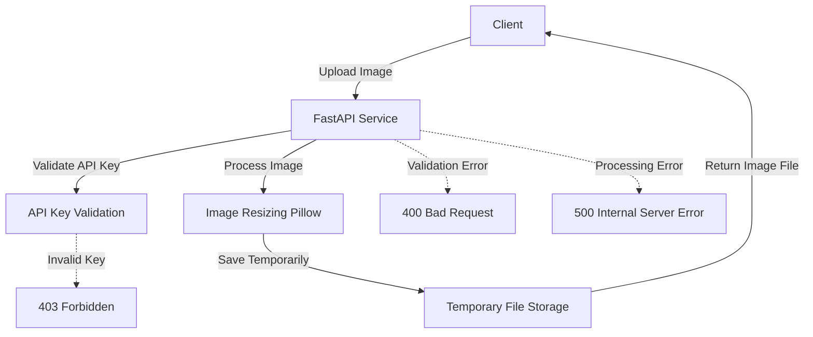

# Image Resize API

## Description

L'Image Resize API est un service qui permet de redimensionner des images selon les dimensions spécifiées par l'utilisateur. Ce service est conçu pour être utilisé dans différents systèmes grâce à son encapsulation dans un conteneur Docker. L'API offre une authentification via une clé API et propose des endpoints pour vérifier la disponibilité du service ainsi que pour redimensionner les images.

## 1. Spécification technique

### 1.1 Technologies utilisées
- **FastAPI** : Framework web rapide et moderne basé sur ASGI pour Python.
- **Pillow** : Bibliothèque Python pour le traitement d'images.
- **Docker** : Conteneurisation du service pour assurer la portabilité.
- **Python-dotenv** : Gestion des variables d'environnement.

### 1.2 Endpoints
- **GET /ping** : Vérifie la disponibilité du service. Retourne `{"message": "Pong!"}`.
- **POST /resize-image** : Redimensionne l'image fournie selon les dimensions spécifiées.

#### Requête POST /resize-image
- **Paramètres de requête** :
  - `width` (int) : Largeur désirée de l'image redimensionnée.
  - `height` (int) : Hauteur désirée de l'image redimensionnée.
- **En-têtes** :
  - `X-API-Key` : Clé API pour l'authentification.
- **Corps de la requête** :
  - `file` : Fichier d'image à redimensionner, envoyé comme fichier multipart/form-data.

#### Réponse
- En cas de succès, la réponse contiendra l'image redimensionnée.
- En cas d'erreur (par exemple, mauvais type de fichier, dimensions non valides, ou fichier trop volumineux), un message d'erreur sera renvoyé.

### 1.3 Sécurité
- **Authentification par clé API** : Chaque requête à l'endpoint de redimensionnement doit inclure une clé API valide dans l'en-tête.

### 1.4 Tests unitaires
Les tests unitaires sont fournis pour vérifier le bon fonctionnement de l'API, incluant la vérification de l'endpoint `/ping` et le processus de redimensionnement d'images.

## 2. Schéma d'architecture

### 2.1 Description textuelle

Le schéma d'architecture de l'API est relativement simple et se compose des éléments suivants :

- **Client** : Envoie des requêtes HTTP au service via les endpoints définis.
- **API Gateway (FastAPI)** : Gère les requêtes, applique l'authentification par clé API, et dirige les requêtes vers le composant approprié.
- **Service de redimensionnement d'image** : Prend en charge le traitement des images, notamment leur redimensionnement, et retourne l'image modifiée au client.
- **Docker** : Le service est encapsulé dans un conteneur Docker pour assurer la portabilité sur différents systèmes d'exploitation et environnements.

### 2.2 Entrées et Sorties
- **Entrée** : Fichier d'image, largeur et hauteur souhaitées, clé API.
- **Sortie** : Fichier d'image redimensionné.

Voici un schéma textuel simplifié :


## 3. Documentation pour le déploiement et l'utilisation

### 3.1 Prérequis
- **Docker** doit être installé sur la machine où l'application sera déployée.
- **Clé API** : Assurez-vous d'avoir une clé API valide configurée dans le fichier `.env`.

### 3.2 Installation et démarrage

1. **Cloner le dépôt** :
   ```bash
   git clone https://github.com/Arturo2511/image-resize-api.git
   cd image-resize-api
   ```

2. **Configurer les variables d'environnement** :
   Créez un fichier `.env` à la racine du projet avec les variables suivantes :
   ```plaintext
   API_KEY=ohoh!
   MAX_FILE_SIZE=4194304  # 4MB
   ALLOWED_EXTENSIONS=jpeg,jpg,png,gif
   ```

3. **Construire l'image Docker** :
   ```bash
   docker build -t image-resize-api .
   ```

4. **Démarrer le conteneur Docker** :
   ```bash
   docker run -d -p 8000:8000 --env-file .env --name image-resize-container image-resize-api
   ```

5. **Accéder à l'API** :
   L'API sera disponible à l'adresse `http://localhost:8000`. Vous pouvez vérifier qu'elle fonctionne en envoyant une requête à l'endpoint `/ping`.

### 3.3 Utilisation de l'API

1. **Vérifier la disponibilité** :
   - Endpoint : `GET /ping`
   - Requête :
     ```bash
     curl http://localhost:8000/ping
     ```

2. **Redimensionner une image** :
   - Endpoint : `POST /resize-image`
   - Requête :
     ```bash
     curl -X POST "http://localhost:8000/resize-image?width=100&height=100"      -H "X-API-Key: ohoh!"      -F "file=@path_to_your_image.jpg"      --output resized_image.jpg
     ```

   Cela enverra une image à l'API, qui retournera l'image redimensionnée, enregistrée sous le nom `resized_image.jpg`.

### 3.4 Documentation de l'API
    
- **Swagger UI** : L'API FastAPI fournit une documentation interactive via Swagger UI. Vous pouvez y accéder à l'adresse `http://localhost:8000/docs`.
- **Redoc** : Une autre documentation interactive est disponible à l'adresse `http://localhost:8000/redoc`.
- **OpenAPI JSON** : Le schéma OpenAPI de l'API est accessible à l'adresse `http://localhost:8000/openapi.json`.
- **ReDoc JSON** : Le schéma ReDoc de l'API est accessible à l'adresse `http://localhost:8000/redoc.json`.

### 3.5 Tests unitaires

1. **Exécuter les tests unitaires** :
   ```bash
   pytest
   ```

   Les tests vérifieront la disponibilité du service et le bon fonctionnement du redimensionnement d'image.

### 3.5 Dépannage

- **Problèmes de connexion** : Assurez-vous que Docker est en cours d'exécution et que le port 8000 est libre.
- **Erreurs d'authentification** : Vérifiez que la clé API dans l'en-tête de la requête correspond à celle configurée dans le fichier `.env`.
